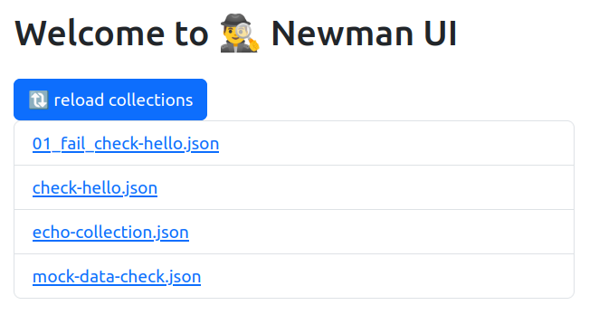
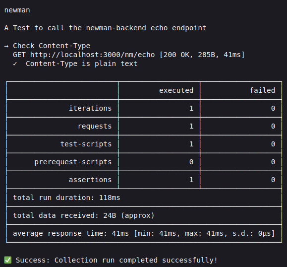

#  🕵️‍♂️ newman-ui
A simple webapp that uses newman to execute postman-collections.





## How to build
```bash
npm run build
``` 

## How to run   
```bash
npm run dev
```

    
## TODOS
* ✅ a webapp that list all postman-collections
* ✅ execute a selected postman-collection and display output
* execute a selected postman-collection and displays specific data 
  * displays a collabsable list
    * uncollabsed - name of collection, execution-time, number-of-test
    * the row is 
      * red if all test fail
      * orange if at least one fail
      * green if none fail
    * collabsed
      * add details for each test
        * name, error (if exists), execution-time
        * red if fail, green when successful
  * add a new collection